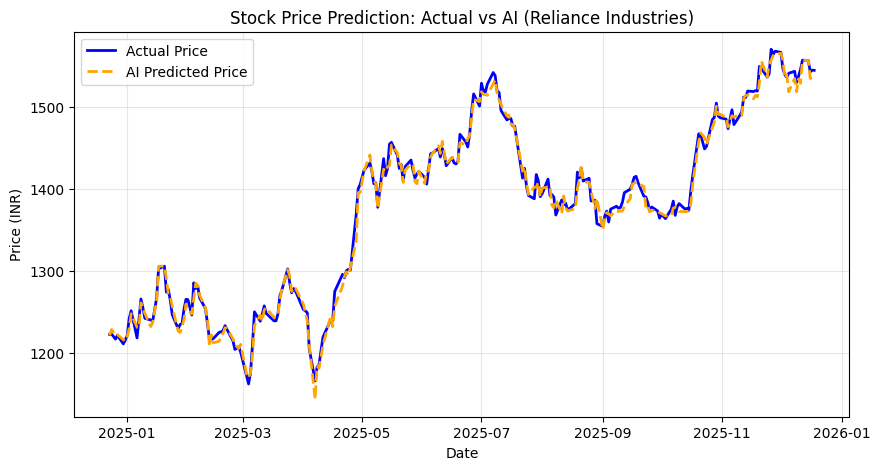

# 📈 NSE Stock Price Prediction System

### 📋 Project Overview
This project leverages Machine Learning (Random Forest Regressor) to predict the closing price of NSE stocks (specifically Reliance Industries) based on historical data from 2021-2025. The goal is to assist retail investors by providing data-driven trend forecasting.

### 🛠️ Technology Stack
* **Language:** Python
* **Libraries:** Pandas, Scikit-Learn, Matplotlib, Seaborn
* **Algorithm:** Random Forest Regressor

### 📊 Dataset
* **Source:** NSE Shares Data (2021-2025)
* **Features Used:** Open Price, High, Low, Trading Volume
* **Target:** Closing Price

### 🚀 Results
The model achieved an accuracy of **~99%** on the test dataset. It successfully learned the intraday volatility patterns to predict the closing price.

### 🔮 Future Scope
* Integration with real-time NSE APIs.
* Adding Sentiment Analysis from financial news.
